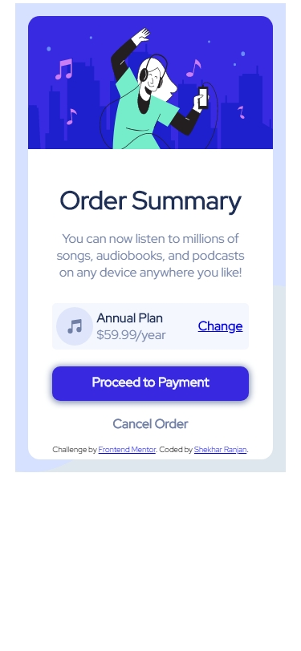
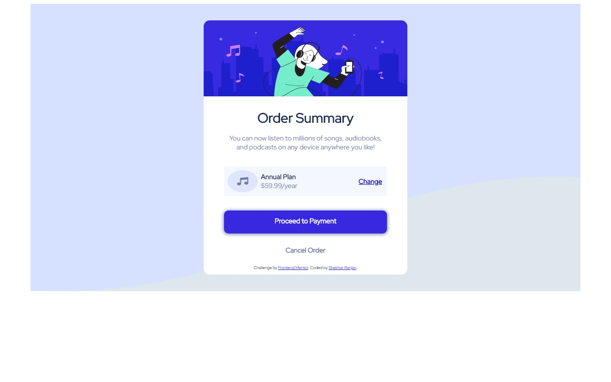

# Frontend Mentor - Order summary card solution

This is a solution to the [Order summary card challenge on Frontend Mentor](https://www.frontendmentor.io/challenges/order-summary-component-QlPmajDUj). 
Frontend Mentor challenges help you improve your coding skills by building realistic projects. 

## Table of contents

- [Overview](#overview)
  - [The challenge](#the-challenge)
  - [Screenshot](#screenshot)
  - [Links](#links)
- [My process](#my-process)
  - [Built with](#built-with)
  - [What I learned](#what-i-learned)
  - [Continued development](#continued-development)
  - [Useful resources](#useful-resources)
- [Author](#author)


## Overview
This is a responsive Order Summary Card with iteractive elements.
### The challenge

Users should be able to:

- See hover states for interactive elements

### Screenshot





### Links

- Solution URL: [Order-Summary-Card](https://github.com/shekhar10feb/Order-Summary-Card)
- Live Site URL: [Order-Summary-Card](https://shekhar10feb.github.io/Order-Summary-Card/)

## My process

My process is in the index.html file firstly, I made a div of class ***container** and then, 
added a div of **main** class. Inside main class, I added,
        
        - Header as main heading, h1 of class name heading
        - Paragraph of class name description 
        - Div of class name premium-plan
        - Div of class name proceed-to-payment
        - Div of class name cancel
        - Div of class name attribution 

Inside **premium-plan** class, I added a div of class name music-annual-plan-money-and-change.

Inside **music-annual-plan-and-money** class, I added two classes, namely,
       
       - music-annual-plan-and-money class, and
       - change class

Inside **music-annual-and-money** class, I added two classes, namely,

       - image
       - annual-plan-and-money

I added two paragraphes inside **annual-plan-and-money** namely,
       
       - annual-plan
       - money 

Then, in the **change** class, I added an anchor tag inside a paragraph.

After that, in the **proceed-to-payment** class, I added a paragraph.

In the **cancel** class, I added a paragraph.

And lastly, in the **attribution** class, I added 'Challenge by' and 'Coded by' with anchor tags. 

### Built with

       - Semantic HTML5 markup
       - CSS custom properties
       - Flexbox
       - Mobile-first workflow


### What I learned

I learned many new concepts and use it in this project like: 

       - CSS Variables
       - Background-repeat 
       - Background-size
       - Uses of rem and em

   #### 1) CSS Variables 

       These are some particular values, which we can reuse throughout this CSS file and the 
benefit is that when the file is so long and if you want to change some colors then, you have to go 
all over the file, check and change. But using CSS Variables, we can change the color in the root 
and the specific color would change in that section or div or etc.
  
   ```CSS
   :root {
     --body-bg-color: white:
   }

   body {
     background-color: var(--body-bg-color);
   }
   ```
 #### 2) Background-repeat 

       A background-repeat sets how the background image repeated. It can be repeated 
       along horizontal(x-axis), vertically(y-axis) or do not repeat according to the value, we provide.
   
   ```CSS
   .main {
     background-image: url('./images/illustration-hero.svg');
     background-repeat: no-repeat;
   }
   ```
 #### 3) Background-size

      This property sets the element's background image. The image can be cover the whole space, spread 
      upto a given percentage area.

    ```CSS
   .music-annual-plan-and-money .image {
     background-image: url('./images/icon-music.svg');
     background-repeat: no-repeat;
     background-size: 100% 100%;
   }
   ```
 #### 4) Use of rem and em 

     These are relative units, which changes according to the screen resolution, that makes the program 
     fits according to that resolution. 
     
     As rem is based upon the font-size value of the root element, which is the <html> element. And if 
     the <html> element doesn’t have a specified font-size, the browser default value of 16px is used.

    ````CSS
     .html {
       font-size: 30px;
    }
    
    .parent {
        font-size: 2rem;
        /* 30px * 2 = 60px */
    }
    ```

    ```html
    <div class="parent">
        This is parent
    </div>
    ```

     And em unit allows to set the font size of an element relative to the font size of its parent. 
     When the size of the parent element changes, the size of the child changes automatically.

     ```CSS
     .parent {
        font-size: 20px;
    }
  
    .child {
        margin: 1.5em;
        /* 20px * 1.5 = 30px */
    }
    ```
    
    ```html
    <div class="parent">
        This is parent
        <div class="child">
            This is Child in em unit system
        </div>
    </div>
    ```


### Continued development

     I want to focus on the responsiveness of the website and make use of SCSS concepts in this project 
     in future.


### Useful resources

     - [Background-size](https://developer.mozilla.org/en-US/docs/Web/CSS/background-size) - This concept 
     really helped to fit in the image in a div with value of width and height are 100%, with makes it to 
     cover the full div. I really like this and use it in future projects, whenever required. 
     - [Difference between em and rem units in CSS](https://www.geeksforgeeks.org/difference-between-em-and-rem-units-in-css/) - This 
     is an amazing article which helped me finally understand the difference between rem and em. I'd recommend it to anyone still learning this concept.
     - [CSS Units](https://www.w3schools.com/cssref/css_units.asp) - This is a very good article on CSS Units, which helped me 
     to understand the various units of CSS.
 

## Author

     - Frontend Mentor - [@shekhar10feb](https://www.frontendmentor.io/profile/shekhar10feb)
     - Twitter - [@MontygSharma](https://twitter.com/MontygSharma)


